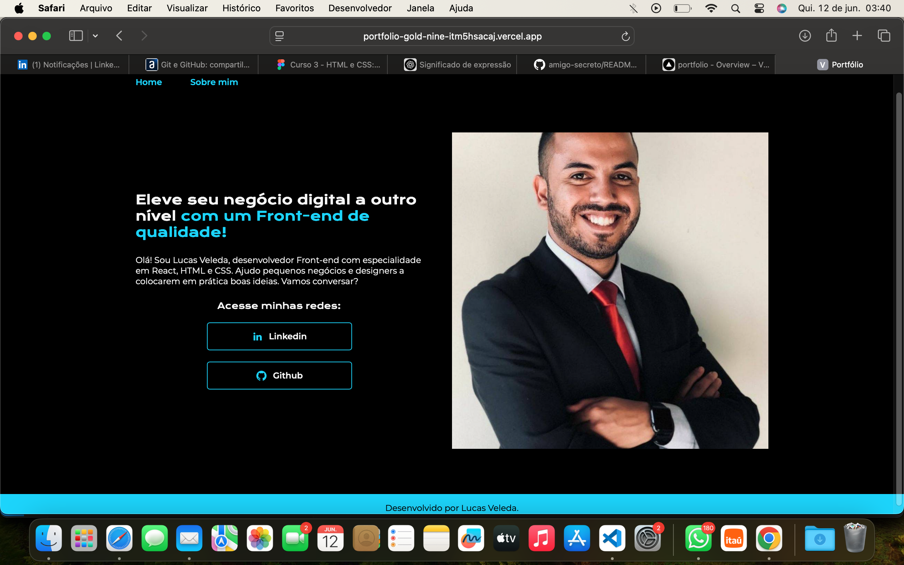
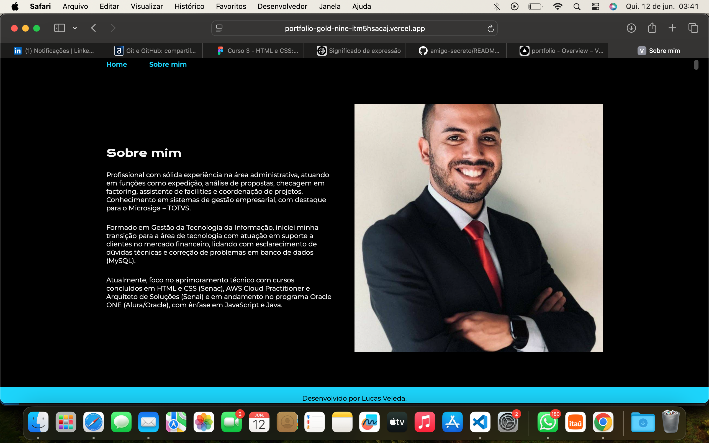

#  Portfólio

Criei meu primeiro portfólio utilizando as linguagens HTML e CSS, aplicando os conhecimentos adquiridos nos cursos da Alura. Este projeto representa o início da minha trajetória prática no desenvolvimento web.

# Descrição do Projeto:

O objetivo deste projeto é proporcionar experiência prática e familiarização com linguagens de marcação, consolidando o conhecimento adquirido. Além disso, busca servir como uma vitrine para demonstrar às empresas contratantes as habilidades que já desenvolvi por meio das soluções que elaborei.

# Funcionalidades da Pagina:

- Home, pagina inicial com um breve resumo e uma frase de efeito.
- Sobre mim, um breve resumo profissional.

 

# Paginas do Projeto:

# Como Acessar o Projeto:

1. Visite o site: https://portfolio-gold-nine-itm5hsacaj.vercel.app/index.html

2. É possível através do git clonar acessar o repositório pelo link: https://github.com/LucasVeleda/portfolio